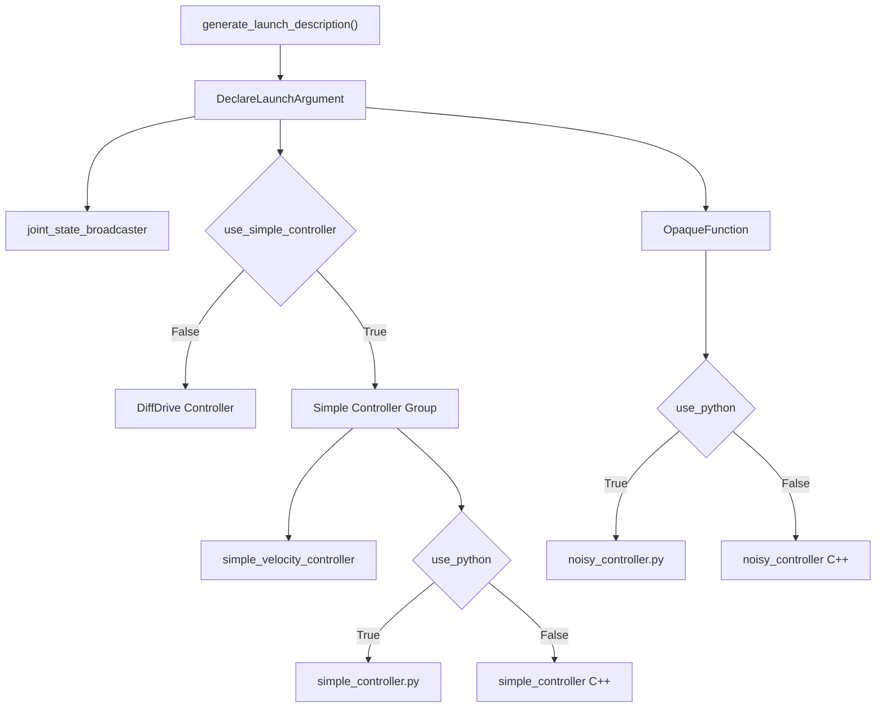

# ROS 2 Joystick Control Architecture

```mermaid
flowchart TD
    A["generate_launch_description()"] --> B["DeclareLaunchArgument"]
    B --> C["joint_state_broadcaster"]
    B --> D{"use_simple_controller"}
    D -->|False| E["DiffDrive Controller"]
    D -->|True| F["Simple Controller Group"]
    F --> G["simple_velocity_controller"]
    F --> H{"use_python"}
    H -->|True| I["simple_controller.py"]
    H -->|False| J["simple_controller C++"]
    B --> K["OpaqueFunction"]
    K --> L{"use_python"}
    L -->|True| M["noisy_controller.py"]
    L -->|False| N["noisy_controller C++"]
```